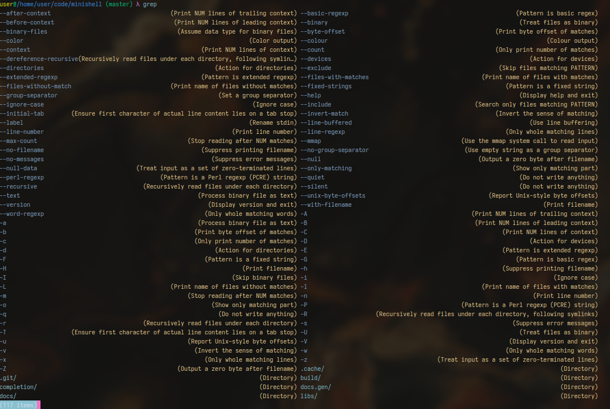

# Minishell -- A simple C shell

# Authors:
 - [ef3d0c3e](https://github.com/ef3d0c3e)
 - [Cheldux](https://github.com/Cheldux)

# Building

To build `minishell`, use the following:
`make`

## Installing

Once you have compiled `minishell`, move the executable within your `$PATH`.
Then you can move the `default.sh` file to either `~/.hshrc` or `$XDG_CONFIG_HOME/hsh/profile.sh`.

If you want to enable completion, then set the `SHELL_COMPLETION` variable to the locaiton of the `completion` folder.

## Running tests

To build the tests, use the following:
`make tests` (built under ./tests)

To run tests, use the following command: `./tests [CATEGORY [NUM]]`
Where
 * `CATEGORY` is the test's category name (for instance `pipe` for pipe tests)
 * `NUM` is the test number

## Build options

 - `DBG` build with debug flag `-ggdb`, *default: 0*
 - `C` sets the C compiler to use, *default: gcc*
 - `MUSL` build with musl libc, instead of the compiler's default. Additionally,
 values `MUSL_LIBS`, `MUSL_INCS` and `MUSL_LD` can be specified to set where to
 look for musl files. Possible values:
    - `x86_64` build with musl for x86_64 architecture.

# Documentation

## Profile

The shell will attempt to source it's default profile file from `~/.hshrc`.
If this fails, it will then attempt to search for `$XDG_CONFIG_HOME/hsh/profile.sh`.
If a profile still couldn't be sourced, the default profile will be used.

## Regex / Pattern matching

Pattern matching is partially implemented to follow bash's rules.
Notable exceptions include the following:
 - Character class range aren't implemented: `[a-z]`, `[aZ-0a]` (etc..) haven't been
 implemented
 - The regex is built on a byte-basis (not codepoint-basis), therefore escaping a unicode
 character can lead to surprising results. For instance `\Σ` aka `5c ce a3` leads only the byte after `5c` to be escaped.
 In practice this is not a problem because only ASCII characters are reserved words for the regex, the rest has to match literally.
 - Similarly, `nocaseglob` only applies to ASCII characters. Other characters (i.e unicode) have to match literally.
 - Complex regexes, e.g with `extglob` can mess up tokenization, a workaround is to
 store them in variables. For instance:
    - `echo !(foo|*.c)` will not be recognized, instead write the following:
    `PAT="!(foo|*.c); echo $PAT"`. This ugly workaround prevents `(|)` from being
    parsed.
 - Pattern exclusion rules, `GLOBIGNORE` and `FIGNORE` are not supported.
 - Changing rule `globskipdots` is not possible, but it is enabled by default.

The following option (available via the `shopt` builtin) are implemented:
 - `extglob`: Allow extended patterns, defaults: `0`
    - `?(PATTERN-LIST)`
        match zero or one occurrence of the given patterns.
    - `*(PATTERN-LIST)`
        match zero or more occurrences of the given patterns.
    - `+(PATTERN-LIST)`
        match one or more occurrences of the given patterns.
    - `@(PATTERN-LIST)`
        match one of the given patterns.
    - `!(PATTERN-LIST)`
        match anything except one of the given patterns.
 - `globstar`: Allow the `**` pattern which will match subdirectory when followed by a `/`, defaults: `0`
 - `dotglob`: Allow files starting with `.` to match when using `*` or `**`, defaults: `0`
 - `nocaseglob`: **ASCII** characters comparison is done in a case-insensitive manner, defaults: `0`

## Loop constructs

The shell supports the following loop constructs:
 - `while CMD; do CMD-LIST; done`
 Run `CMD-LIST` while `CMD` is **true** (returns 0)
 - `until CMD; do CMD-LIST; done`
 Run `CMD-LIST` while `CMD` is **false** (returns non-zero)
 - `for IDENT in LIST; do CMD-LIST; done`
 Run `CMD-LIST` for each element in `LIST`, mapping each value in `LIST` to `IDENT`.

The following special builtins for manipulating control flow are implemented:
 - `break [N]` (`N` defaults to 1)
 - `continue [N]` (`N` defaults to 1)

*NOTE: In cases where `N` is greater than the number of loops, an error is displayed,
unlike bash which displays an error only if there are 0 active loops*

# TODO List

 * `case` statements
 * Implement parameter substitution completely
 * Implement close redirections
 * Implement aliases (currently functions can be used as a replacement)
 * Implement the `shopt`/`set` builtin
 * Better program-based completion
 * Implement auto-completion (ala fish)
 * Some way to debug the shell's evaluation (e.g bash -x)
 * Arithmetic expansion `$((2+2))`
 * Line wrapping for getline
 * Implement job control
 * Implement the time keyword

# License

This project is licensed under the GNU GPL version 3.
See [LICENSE](./LICENSE) for more informations.
